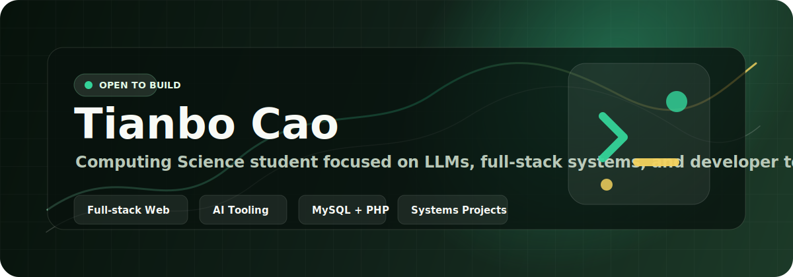

  

  
  
  

## Hello

I am Tianbo Cao, a DIICSU '27 computing science student building course projects, AI tooling experiments, and full-stack web systems.

I care about projects that are concrete enough to run: clear data models, usable interfaces, and code that makes the workflow easier to understand.

<table>
  <tr>
    <td width="55%" valign="top">
      <h3>Now Building</h3>
      
<strong>Summit Gear & Adventures</strong>

      
A database coursework project for an outdoor equipment shopping website, built with customer, staff, supplier, and admin portals.

      

        
        
        
      

    </td>
    <td width="45%" valign="top">
      <h3>Profile Snapshot</h3>
      
<strong>Location:</strong> Changsha, China

      
<strong>Interests:</strong> LLMs, AI-assisted development, web apps, systems projects

      
<strong>Style:</strong> practical builds, clean structure, readable workflows

    </td>
  </tr>
</table>

## Project Gallery

<table>
  <tr>
    <td width="50%" valign="top">
      <h3>Summit Gear & Adventures</h3>
      
Private database coursework project for a multi-portal outdoor equipment shopping website.

      

        
        
        
      

    </td>
    <td width="50%" valign="top">
      <h3><a href="https://github.com/tiempo0206/claude-code-src">claude-code-src</a></h3>
      
TypeScript code assistant exploration and forked development work.

      

    </td>
  </tr>
  <tr>
    <td width="50%" valign="top">
      <h3><a href="https://github.com/tiempo0206/ScrabbleGame">ScrabbleGame</a></h3>
      
A Java project focused on implementing game logic and structured interaction.

      

    </td>
    <td width="50%" valign="top">
      <h3><a href="https://github.com/tiempo0206/ManchesterBaby">ManchesterBaby</a></h3>
      
A C systems project simulating the Manchester Baby with an assembler and hardware simulator.

      

    </td>
  </tr>
</table>

## Toolbox

  
  
  
  
  
  
  
  
  
  

## GitHub Activity

  
  

## Connect

  

