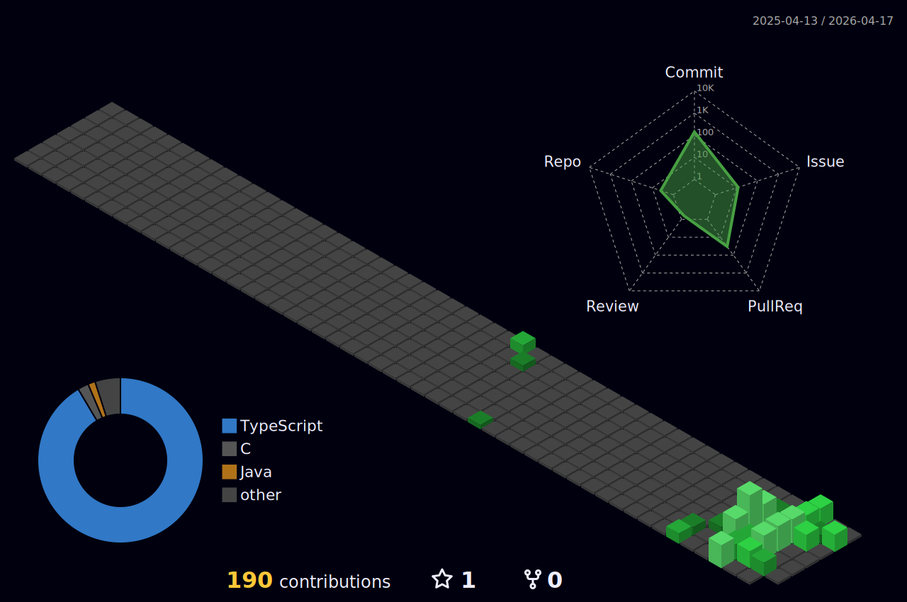

<h1 align="center">Hi, I am Tianbo Cao</h1>

  

  
  
  

## About Me

<table>
  <tr>
    <td width="58%" valign="top">
      
I am a DIICSU '27 computing science student based in Changsha, China.

      
I am interested in LLMs, AI-assisted development, practical web systems, and developer tooling.

      
My current coursework project is <strong>Summit Gear & Adventures</strong>, an outdoor equipment shopping website with customer, staff, supplier, and admin portals.

    </td>
    <td width="42%" valign="top">
      
<strong>Currently learning</strong>

      
Full-stack web workflows, MySQL schema design, PHP APIs, Java/C fundamentals, and AI tooling patterns.

      
<strong>Build style</strong>

      
Make the data model clear, keep the UI usable, and leave the project easy to explain.

    </td>
  </tr>
</table>

## Tech Stack

  
  
  
  
  
  
  
  
  
  

## GitHub Dashboard

<h3 align="center">3D Contribution Map</h3>

  

  

  
  

  
  

  

  

## Connect

  

